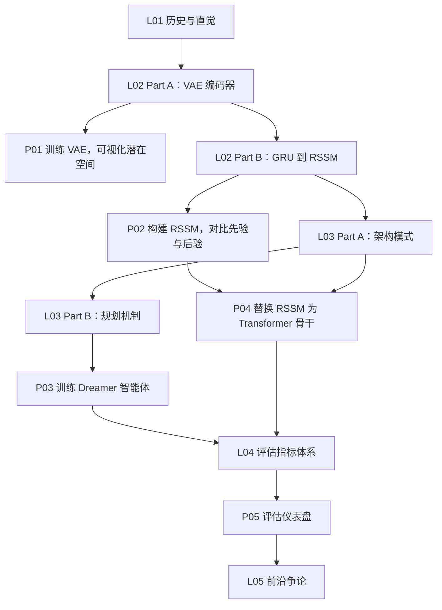

<div align="center">
  
  <br>

[English](./README.md) · [中文](./README-CN.md)

# Learn World Models（⚠️ Alpha 内测版）

[](https://datawhalechina.github.io/learn-world-model)
[](https://github.com/datawhalechina/learn-world-model/stargazers)
[](https://github.com/datawhalechina/learn-world-model/blob/main/LICENSE)
> **通过动手构建掌握世界模型：从潜在动力学的直觉，到可运行的仿真、规划与评估系统。**

</div>

> [!CAUTION]
> ⚠️ **Alpha 内测版本**：此为早期构建版本，内容仍在持续补全与调整中，部分章节、示例或表述可能继续变化。欢迎通过 Issue 反馈问题或建议。

---

## ✨ 界面速览

### 🏠 课程主页
> 清晰的学习路径，讲义与项目分区导航。


### 📖 讲义页面
> 概念优先的讲解风格，配合 mermaid 流程图与面向深度学习读者的背景知识框。


### 🗂️ 架构深度解析
> 七大架构族、三种规划机制、逐维对比表格。


---

## 本课程涵盖什么

五讲 + 五个项目，从世界模型的直觉出发，最终构建出可运行的三模型评估仪表盘。

| # | 类型 | 标题 | 核心内容 |
|---|------|------|---------|
| L01 | 讲义 | 内部仿真与历史背景 | Craik 的心智模型、预测编码、世界模型演化的四个时代 |
| L02 | 讲义 | 观测编码与潜在动力学 | VAE、CNN 编码器、ELBO，GRU → MDN-RNN → RSSM |
| L03 | 讲义 | 架构模式、学习范式与规划 | 七大架构族、CEM-MPC、潜在 Actor-Critic、TD-MPC |
| L04 | 讲义 | 按模型划分的评估指标 | FID、奖励相关性、一致性损失、PSNR、时程漂移 |
| L05 | 讲义 | 前沿争论 | 语言 vs 物理 grounding、Bitter Lesson、AGI 作为研究目标 |
| P01 | 项目 | 训练 VAE 编码器 | 小型 CNN VAE 处理 64×64 像素观测；ELBO 损失曲线；潜在维度滑块可视化 |
| P02 | 项目 | 构建 RSSM 动力学模型 | GRU、MDN-RNN、RSSM 三者对比；先验与后验轨迹对比图 |
| P03 | 项目 | 训练 Dreamer 智能体 | 完整训练循环：编码器 + RSSM + 潜在 Actor-Critic，在小型像素环境上训练 |
| P04 | 项目 | 替换动力学骨干网络 | 将 RSSM 替换为小型因果 Transformer（STORM 风格）；架构对比分析 |
| P05 | 项目 | 世界模型评估仪表盘 | 两个模型指标并排展示：FID、奖励相关性、PSNR、潜在漂移曲线 |

---

## 课程路线图



推荐学习顺序：L01、L02、P01、P02、L03、P03、P04、L04、P05、L05

不需要把所有理论读完再动手。先构建，带着问题回来看下一讲，效果更好。

---

## 快速开始

```sh
npm install
npm run docs:dev        # 开发服务器（热更新）
npm run docs:build      # 生产构建
npm run docs:preview    # 预览构建结果
```

构建之后刷新 README 截图：

```sh
npm run docs:build
npm run screenshots:readme
```

---

## 仓库结构

```
learn-world-model/
├── docs/                                  # VitePress 文档站
│   ├── .vitepress/config.mts             # 导航与侧边栏（EN + ZH）
│   ├── en/lectures/                       # 5 个英文讲义页
│   ├── zh/lectures/                       # 5 个中文讲义页
│   ├── en/projects/                       # 5 个英文项目页
│   └── zh/projects/                       # 5 个中文项目页
├── external/world-model-tutorial/         # 项目引用的 PyTorch 源码
│   └── references.md                      # 四时代历史与架构综述
├── scripts/                               # 构建工具（截图、PDF）
└── package.json
```

---

## 交流社群

扫描二维码加入微信交流群：

<div align="center">
  
</div>

---

## 参与贡献

欢迎提交 Pull Request。在提交之前，请阅读 [CLAUDE.md](./CLAUDE.md) 中适用于所有讲义和项目文件的写作规范（禁用破折号、禁止线性 mermaid 图、禁止箭头链式行文、中英文同步更新等）。不符合规范的内容需修改后方可合并。

---

## 贡献者名单（教程部分）

| 姓名 | 职责 | 简介 | GitHub |
| ---- | ---- | ---- | ------ |
| 赵志民 | 项目负责人 | 皇后大学 | [@zhimin-z](https://github.com/zhimin-z) |
| 王琦 | 项目负责人 | 上海交通大学 | [@qiwang067](https://github.com/qiwang067) |
