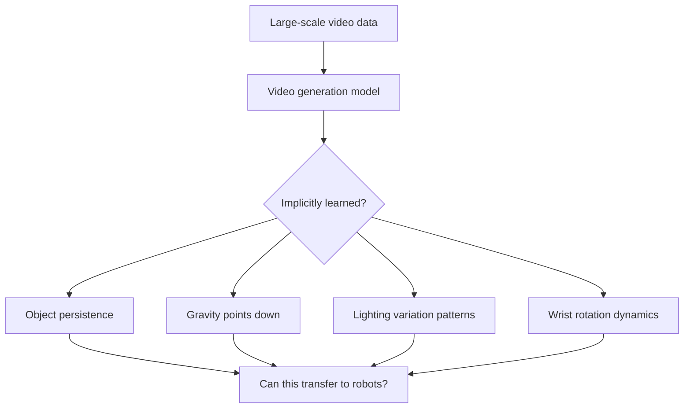
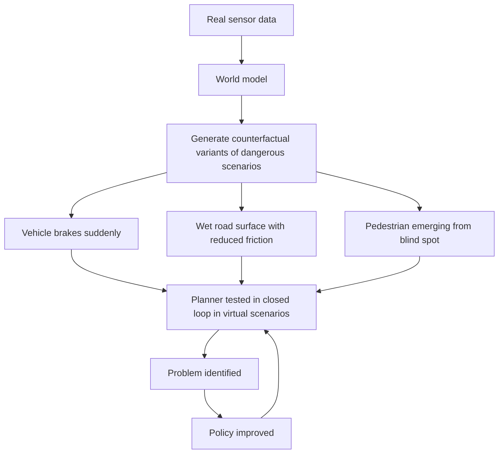

# What World Models Solve, and Why Now

## What Problems Do World Models Solve?

**1. Sample Complexity**

> **📖 Background: Reinforcement Learning (RL)**
> Reinforcement learning is a framework for training an agent to learn by interacting with an environment. At each time step the agent selects an **action**, the environment returns a new **observation** and a **reward signal** (higher values indicate better outcomes). The agent's goal is to learn a **policy**: which action to take in each state in order to maximize cumulative long-term reward.
>
> **Model-free RL**: the agent learns a policy directly from repeated trial-and-error interaction with the environment, without building any internal model of how the world works. Simple in principle, but requires an enormous number of real interactions ("samples") to learn.
>
> **Model-based RL**: first learn a world model (predicting the consequences of actions), then use that model to simulate large numbers of trajectories in "imagination", reducing the number of real environment interactions needed.

Model-free reinforcement learning requires millions of real interactions to learn even a simple task. A world model lets an agent "virtually experience" tens of thousands of **rollouts** (complete sequences starting from an initial state and executing actions according to a policy) through internal simulation, reducing real environment interactions by several orders of magnitude.

**2. Planning Capability**
With a world model, an agent can mentally rehearse several candidate action sequences before acting, select the one with the highest expected return, rather than blindly probing the real environment.

**3. Safety**
In robotics, autonomous driving, and industrial control, the cost of trial-and-error can be catastrophic. World models make it possible to stress-test and repair a policy in a sandbox before deploying it on real hardware.

---

## The Gap: Why World Models Went Quiet

After the initial wave of enthusiasm around 2018 to 2020, the world model field gradually cooled. Dreamer, RSSM, and PlaNet generated real excitement, but prolonged research revealed a consistent set of problems: predictions degraded quickly over time, long-horizon trajectories collapsed, errors accumulated step by step, and generated video frames blurred within a few steps. These were not just engineering difficulties; they pointed to a fundamental capability gap.

Meanwhile, the broader field was moving elsewhere. The success of scaling laws convinced many researchers that larger data and larger models could handle everything end-to-end. VLMs and VLAs exploded in capability. World models, by contrast, started to feel like an older idea being left behind.

In retrospect, the problem was never that the *idea* was wrong. The problem was that the generative capability required to make it work did not yet exist. A world model needs to stably generate coherent futures, step after step, without drifting. Earlier video prediction architectures simply could not do this: a few frames out, the output blurred into noise.

That changed with diffusion models and video foundation models. For the first time, AI systems gained the ability to generate continuous, temporally coherent world states. This is the root cause of the resurgence: not a new theoretical insight, but a newly acquired generative capability that made the old idea suddenly viable.

The implication is easy to miss: the most significant contribution of diffusion models may not be image synthesis. It may be that they gave AI the ability to model how the world *evolves*, because the real world is itself a continuous temporal process, and video is just world state sampled through time.

## Why Are World Models Hot Again Now?

World models are not a new concept. The paper by Ha & Schmidhuber [2] was published in 2018, and model-based reinforcement learning (MBRL) has been learning environment dynamics since the 2000s. Dreamer has already iterated to its third version. So why did this field suddenly become the centerpiece of every AI conference between 2024 and 2026?

The answer is not a single paper. It is **three technical threads converging within the same time window**, producing a resonance effect.

### Thread 1: Video Generation Models Become Suddenly Powerful

Veo (Google DeepMind), Genie (Google DeepMind), and Cosmos (NVIDIA) all emerged in 2024, demonstrating striking capabilities from large-scale video pretraining.

They prompted researchers to take seriously the following question: do these models, in the process of generating photorealistic video, incidentally learn some notion of **spatial structure, object persistence, and coarse-grained physical regularities**? If so, can they serve as an underlying world model for robots or agents?

That question has no definitive answer yet, but it is precisely what brought the video generation community and the robot control community to the same table.

### Thread 2: Embodied Intelligence Hits a Data Bottleneck

Vision-Language-Action models (VLA, end-to-end models that take visual observations and language instructions as input and output robot actions directly, such as RT-2 and OpenVLA) have demonstrated the possibility of generalizable robot skills, but they carry a critical dependency: **large quantities of teleoperation demonstration data**.

> **📖 Teleoperation**: an operator controls the robot in real time using a joystick, data glove, or exoskeleton, while the robot simultaneously records observations and the corresponding joint actions. The resulting data is well-structured and fully annotated, but collection is extremely expensive: it requires specialized hardware, skilled operators, and substantial time, with per-hour collection costs potentially reaching thousands of dollars.

Collecting a single robot manipulation trajectory requires specialized hardware, skilled operators, and a real physical setting. By contrast, the internet hosts billions of videos of humans manipulating objects, but these videos carry no action annotations, no joint angles, and no torque signals.

World models offer a path around this bottleneck: if a world model can learn "how humans interact with objects" from unannotated video, and then use **latent actions** (implicit action encodings automatically extracted from inter-frame differences, which do not correspond to specific joint angles but instead capture "what type of change occurred between adjacent frames", see Lecture 3 on Genie) to translate that understanding into a controllable dynamics model, a robot could "indirectly learn" from internet video without requiring every action to be manually annotated.

This is not a solved problem, but the potential is compelling enough that nearly every top robotics team is betting on this direction.

<figure>

<figcaption>Hu et al. (2023) GAIA-1 architecture schematic: historical video frame sequences, natural language descriptions, and action signals are used as joint inputs to a generative world model that predicts future video frames, enabling controllable simulation of driving scenarios. GAIA-1 demonstrated the feasibility of using video generation capability directly for autonomous driving counterfactual testing, and is an early representative of the intersection between autonomous driving and generative world models.</figcaption>
</figure>

### Thread 3: Autonomous Driving Has Already Proven the Value of Counterfactual Simulation

Autonomous driving is one of the earliest industrial domains where world models have been deployed, and it has already produced clear commercial validation.

**Corner cases** on real roads are extremely rare: a pedestrian suddenly rushing out during a blizzard, a large truck overturning at an intersection, a wheelchair user crossing illegally. These scenarios may occur only once every millions of kilometers, yet they are precisely where autonomous driving systems are most likely to fail.

The world model solution:

Wayve's GAIA-1, Tesla's world model simulation, and Waabi's counterfactual training are industrial deployments that have already demonstrated WM-driven data augmentation can increase coverage of safety-critical test scenarios by orders of magnitude, at roughly one-thousandth the cost of real-road testing.

### The Three Threads Converge

Viewed together, the nature of today's world model resurgence becomes clear:

This is not a trend driven by a single paper. Three independent tracks, large-scale video generation, robot learning, and autonomous driving simulation, simultaneously discovered around 2024 to 2026 that world models are a key missing piece for their respective problems. Video generation models supply reusable physical priors, embodied intelligence exposed the data bottleneck of action annotation, and autonomous driving validated the commercial value of counterfactual testing in simulation. Together these pressures pushed the field to center stage.

The previous wave of world model interest (2018 to 2020) was largely academic: researchers demonstrated feasibility in game environments, but practical deployment remained distant. In the current wave (2024 onward) both industry and academia entered simultaneously, because world models now address real cost bottlenecks and safety requirements. The two waves differ substantially in character.

---

## Next Lecture

Having established why world models are needed, the next question is how to build one. Lecture 2 starts from two foundational engineering problems: how to compress high-dimensional pixels into a tractable latent vector (the VAE encoder), and how to predict future states in that low-dimensional space (GRU to MDN-RNN to RSSM). Getting these two components right yields the core skeleton of Dreamer.
