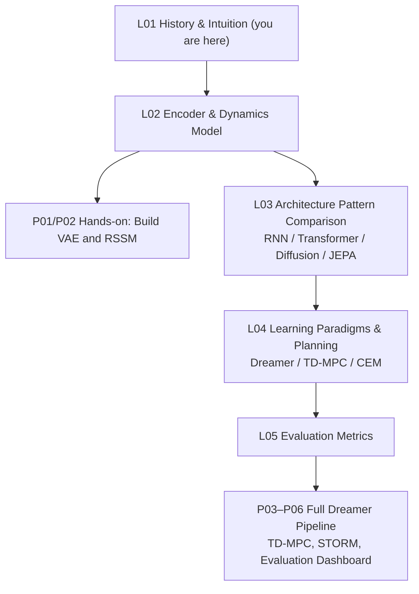

# Curriculum Roadmap

## Curriculum Roadmap

Each step has a corresponding code project. When you get stuck, returning to the relevant section is more effective than reading everything through before writing any code.

---

## Next Lecture

L02 starts from a concrete problem: **how do you compress a 64×64 pixel image into a compact latent vector z?** This is the task of the Variational Autoencoder (VAE), and it is the first building block of the entire Dreamer pipeline.

Once the compression is in place, z is fed into the dynamics model, which learns to predict "what z will look like at the next timestep." That is the RSSM. By the end of L02, you will have written the two most critical modules of a world model by hand, and you will be able to see from real loss curves how they learn.

---

*This lecture requires no mathematical or coding background. If you are interested in the original papers by Craik, Ha & Schmidhuber, or Dreamer, see the further reading in L05.*

---

## Further Reading

- Craik, K.J.W. *The Nature of Explanation*. Cambridge University Press, 1943.
- [Ha & Schmidhuber (2018): World Models](https://arxiv.org/abs/1803.10122): the V/M/C three-module framework and the original paper on training in dreams
- [Hafner et al. (2019): Dream to Control (Dreamer V1)](https://arxiv.org/abs/1912.01603): the first end-to-end implementation of RSSM and latent actor-critic
- [LeCun (2022): A Path Towards Autonomous Machine Intelligence](https://arxiv.org/abs/2306.15364): the JEPA framework and the argument for world models as a cognitive core
